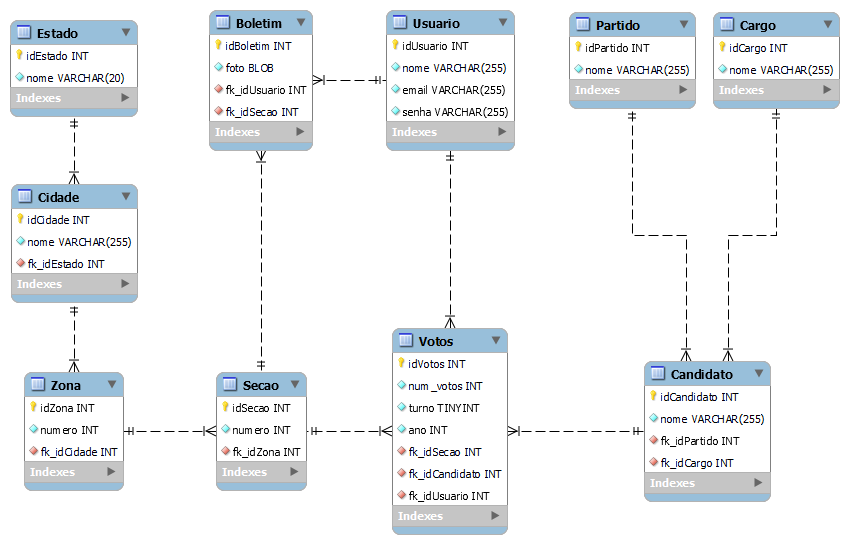

# Trab_BancoDeDados_Server
Arquivos Server-side para fazer a integração com o banco de dados

# Requisitos
- Apache
- PHP 8
- MySQL

# Tutorial de instalação
Instalação Apache + PHP: https://www.youtube.com/watch?v=Y60Vvd4lhtg

OBS: É necessário fazer pequenas mudanças, pois o tutorial é sobre o PHP 7, mas quase tudo é sobre nomeclatura.

# Banco de Dados
- Script:
O script para criação do banco está na pasta database.
Só importar no MySQL Workbench.

- Modelo ER:

